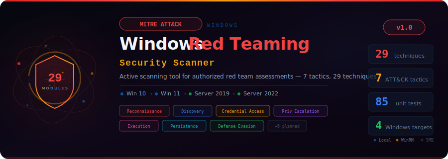

<p align="center">
  
</p>

<p align="center">
  <strong>Active scanning tool for authorized red team security assessments on Windows<br/>
  aligned with the MITRE ATT&CK Framework — 90 techniques, 202 atomic tests across 13 tactics</strong>
</p>

<p align="center">
  
  
  
  
  
  
  
</p>

---

## Overview

**WindowsRedTeaming** is an open-source, Python-based active scanning tool designed for authorized red team security assessments on Windows systems. It evaluates security controls across Windows 10, 11, Server 2019, and Server 2022 by mapping checks directly to [MITRE ATT&CK](https://attack.mitre.org/) techniques.

The tool operates in two modes:

| Mode | Flag | Behavior |
|------|------|----------|
| **Check** *(default)* | -- | Passive, read-only security audit. Safe for production. |
| **Simulate** | `--simulate` | Active technique simulation with automatic cleanup. |

---

## Key Features

- **Dual-mode architecture** -- 29 Python modules (passive check + active simulate) + 202 YAML atomic tests across 61 techniques
- **Atomic Red Team-style YAML tests** -- data-driven test definitions with input arguments, dependencies, cleanup commands, and executor types
- **Module auto-discovery** -- drop a Python module or YAML atomic in the right folder, it's automatically picked up
- **Session abstraction** -- Local (subprocess), Remote WinRM (pypsrp), with SMB/WMI planned
- **ATT&CK Navigator export** -- generates JSON layer files for [ATT&CK Navigator](https://mitre-attack.github.io/attack-navigator/) visualization
- **Multi-format reports** -- HTML (dark theme), JSON, CSV
- **Evidence chain** -- every action logged with timestamps for audit trail
- **Scan profiles** -- quick, full, stealth, or custom YAML profiles
- **OS-aware execution** -- modules declare supported OS and auto-skip incompatible targets
- **13 full MITRE ATT&CK tactics** -- Discovery, Execution, Persistence, Privilege Escalation, Defense Evasion, Credential Access, Lateral Movement, Collection, Command & Control, Exfiltration, Impact, Initial Access, Reconnaissance

---

## MITRE ATT&CK Coverage

| Tactic | ID | Python Modules | Atomic YAML Tests | Total Techniques |
|--------|-----|--------|--------|--------|
| **Reconnaissance** | TA0043 | 1 | -- | 1 |
| **Discovery** | TA0007 | 8 | 19 techniques, 73 tests | 19 |
| **Execution** | TA0002 | 3 | 6 techniques, 24 tests | 6 |
| **Persistence** | TA0003 | 3 | 7 techniques, 20 tests | 7 |
| **Privilege Escalation** | TA0004 | 4 | 1 technique, 4 tests | 5 |
| **Defense Evasion** | TA0005 | 4 | 4 techniques, 17 tests | 6 |
| **Credential Access** | TA0006 | 6 | 6 techniques, 20 tests | 7 |
| **Lateral Movement** | TA0008 | -- | 4 techniques, 12 tests | 4 |
| **Collection** | TA0009 | -- | 5 techniques, 8 tests | 5 |
| **Command & Control** | TA0011 | -- | 3 techniques, 9 tests | 3 |
| **Exfiltration** | TA0010 | -- | 1 technique, 3 tests | 1 |
| **Impact** | TA0040 | -- | 5 techniques, 12 tests | 5 |
| **Total** | | **29 modules** | **61 techniques, 202 tests** | **~90 unique** |

---

## Quick Start

### Prerequisites

- Python 3.10+
- Windows target (local or remote via WinRM)

### Installation

```bash
git clone https://github.com/Krishcalin/Windows-Red-Teaming.git
cd Windows-Red-Teaming
pip install -r requirements.txt
```

### Usage

```bash
# Quick passive scan on local machine (safe, read-only)
python main.py scan --target localhost --profile quick

# Full scan against a remote target via WinRM
python main.py scan --target 192.168.1.10 --profile full

# Scan a specific tactic only
python main.py scan --target localhost --tactic discovery

# Scan a specific technique
python main.py scan --target localhost --technique T1082

# Full scan with active simulation (requires explicit flag)
python main.py scan --target 192.168.1.10 --profile full --simulate

# List all discovered modules (Python + atomic YAML)
python main.py list-modules

# List only atomic YAML tests
python main.py list-modules --source atomic

# Run atomic tests for a specific technique
python main.py run-atomic --target localhost --technique T1082

# Run atomic tests with JSON output
python main.py run-atomic --target localhost --technique T1059.001 --format json

# Generate report from a previous scan
python main.py report --input reports/scan_2026-03-16.json --format html
```

### Output Formats

```bash
# JSON report
python main.py scan --target localhost --format json --output report.json

# HTML report (dark theme)
python main.py scan --target localhost --format html --output report.html

# MITRE ATT&CK Navigator layer
python main.py scan --target localhost --format attack-layer --output layer.json
```

---

## Architecture

```
Windows-Red-Teaming/
|
|-- main.py                          # CLI entry point (click)
|-- core/
|   |-- engine.py                    # Scan orchestrator + module + atomic discovery
|   |-- session.py                   # Local / WinRM session management
|   |-- models.py                    # Target, Finding, ModuleResult, ScanResult
|   |-- atomic_models.py             # AtomicTest, InputArgument, Dependency, Executor
|   |-- atomic_runner.py             # YAML atomic test loader and runner
|   |-- config.py                    # YAML config loader + profile merging
|   |-- logger.py                    # Structured logging + evidence chain
|   |-- reporter.py                  # HTML / JSON / CSV report generation
|   +-- mitre_mapper.py             # ATT&CK Navigator JSON layer export
|
|-- modules/                         # Python modules (passive check + simulate)
|   |-- base.py                      # BaseModule ABC (check/simulate/cleanup)
|   |-- reconnaissance/              # TA0043 -- 1 module
|   |-- discovery/                   # TA0007 -- 8 modules
|   |-- credential_access/           # TA0006 -- 6 modules
|   |-- privilege_escalation/        # TA0004 -- 4 modules
|   |-- execution/                   # TA0002 -- 3 modules
|   |-- persistence/                 # TA0003 -- 3 modules
|   +-- defense_evasion/             # TA0005 -- 4 modules
|
|-- atomics/                         # YAML atomic tests (Atomic Red Team-style)
|   |-- T1082/T1082.yaml            # 10 tests -- System Info Discovery
|   |-- T1087.001/T1087.001.yaml    # 4 tests  -- Local Account Discovery
|   |-- T1059.001/T1059.001.yaml    # 7 tests  -- PowerShell
|   |-- T1547.001/T1547.001.yaml    # 4 tests  -- Registry Run Keys
|   |-- T1562.001/T1562.001.yaml    # 6 tests  -- Disable Security Tools
|   |-- T1003.001/T1003.001.yaml    # 4 tests  -- LSASS Memory
|   |-- T1021.001/T1021.001.yaml    # 4 tests  -- RDP
|   |-- T1105/T1105.yaml            # 5 tests  -- Ingress Tool Transfer
|   |-- T1490/T1490.yaml            # 4 tests  -- Inhibit System Recovery
|   +-- ... (61 techniques total, 202 atomic tests)
|
|-- config/
|   |-- techniques.yaml              # Enable/disable techniques
|   +-- profiles/
|       |-- quick.yaml               # Fast scan (8 key techniques)
|       |-- full.yaml                # All techniques
|       +-- stealth.yaml             # Minimal footprint (4 techniques)
|
|-- templates/
|   +-- report.html                  # Jinja2 dark-themed HTML report
|
+-- tests/                           # 122 pytest tests
```

### Module Contract

Every technique module inherits from `BaseModule` and implements:

```python
class MyTechniqueCheck(BaseModule):
    TECHNIQUE_ID   = "T1082"
    TECHNIQUE_NAME = "System Information Discovery"
    TACTIC         = "Discovery"
    SEVERITY       = Severity.MEDIUM
    SUPPORTED_OS   = [OSType.WIN10, OSType.WIN11, OSType.SERVER_2019, OSType.SERVER_2022]
    REQUIRES_ADMIN = False
    SAFE_MODE      = True

    def check(self, session) -> ModuleResult:     # Passive, read-only
        ...
    def simulate(self, session) -> ModuleResult:  # Active (requires --simulate)
        ...
    def cleanup(self, session) -> None:           # Revert simulate changes
        ...
    def get_mitigations(self) -> list[str]:       # Remediation advice
        ...
```

### Atomic Test YAML Format

Atomic tests are defined in YAML files under `atomics/<technique_id>/`. Each file contains multiple tests for a single ATT&CK technique, inspired by [Atomic Red Team](https://github.com/redcanaryco/atomic-red-team):

```yaml
attack_technique: T1082
display_name: "System Information Discovery"
tactic: Discovery
atomic_tests:
  - name: "System Information via systeminfo"
    auto_generated_guid: a0f7e4b1c2d3e4f5a6b7c8d9e0f1a2b3
    description: |
      Executes systeminfo to gather OS version and hardware details.
    supported_platforms:
      - windows
    input_arguments:
      output_file:
        description: "Output file path"
        type: path
        default: "%TEMP%\\sysinfo.txt"
    dependencies:
      - description: "Tool must exist"
        prereq_command: "where systeminfo"
    executor:
      name: command_prompt          # or: powershell, manual
      command: |
        systeminfo > #{output_file}
      cleanup_command: |
        del /f #{output_file} >nul 2>&1
      elevation_required: false
```

**Execution modes:**
- **check** -- Python modules run passive security audit (read-only)
- **simulate** -- Python modules + YAML atomic tests execute against the target
- **run-atomic** -- Run YAML atomic tests directly for a specific technique

---

## Scan Profiles

| Profile | Tactics | Techniques | Simulate | Use Case |
|---------|---------|------------|----------|----------|
| `quick` | Discovery, Credential Access, Defense Evasion | 8 high-value | No | Fast security posture check |
| `full` | All enabled | All enabled | No | Comprehensive passive audit |
| `stealth` | Discovery, Defense Evasion | 4 minimal | No | Low-footprint recon |

---

## Target OS Support

| Feature | Win 10 | Win 11 | Server 2019 | Server 2022 |
|---------|:------:|:------:|:-----------:|:-----------:|
| Local scan | Yes | Yes | Yes | Yes |
| WinRM remote | Yes | Yes | Yes | Yes |
| AMSI checks | Yes | Enhanced | Yes | Enhanced |
| Credential Guard | Optional | Default | Optional | Optional |
| NTDS.dit checks | -- | -- | Yes | Yes |
| AD/Domain checks | -- | -- | Yes | Yes |

---

## Safety & Authorization

> **WARNING:** This tool performs active security testing. Use ONLY on systems you are authorized to test. Unauthorized access to computer systems is illegal.

- Targets must be explicitly configured
- Default mode is **check-only** (passive, read-only)
- Active simulation requires the explicit `--simulate` CLI flag
- Authorization banner displayed before every scan
- Every action produces a timestamped audit log entry
- `cleanup()` is called automatically after every simulation
- Modules auto-skip if the target OS is not supported

---

## Development

### Running Tests

```bash
pip install pytest
python -m pytest tests/ -v
```

### Adding a New Module

1. Create `modules/<tactic>/T{ID}_{name}.py`
2. Inherit from `BaseModule` and set all class attributes
3. Implement `check()`, `simulate()`, `cleanup()`, `get_mitigations()`
4. Add tests in `tests/test_modules/`
5. The engine auto-discovers it on next run

### Roadmap

- [x] **Phase 1** -- Foundation (engine, sessions, CLI, config, reporting)
- [x] **Phase 2** -- Discovery & Reconnaissance (9 modules)
- [x] **Phase 3** -- Credential Access & Privilege Escalation (10 modules)
- [x] **Phase 4** -- Execution, Persistence & Defense Evasion (10 modules)
- [ ] **Phase 5** -- Lateral Movement, C2 & Exfiltration
- [ ] **Phase 6** -- Reporting & ATT&CK Integration enhancements
- [ ] **Phase 7** -- Testing & CI/CD hardening

---

## License

[MIT License](LICENSE) -- Copyright (c) 2026 KRISH

---

<p align="center">
  <sub>Built for authorized security testing and red team assessments only.</sub>
</p>
